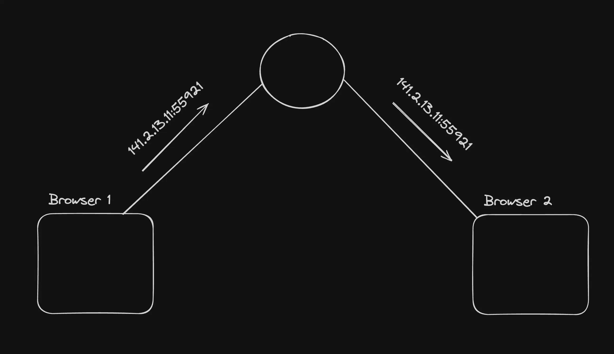
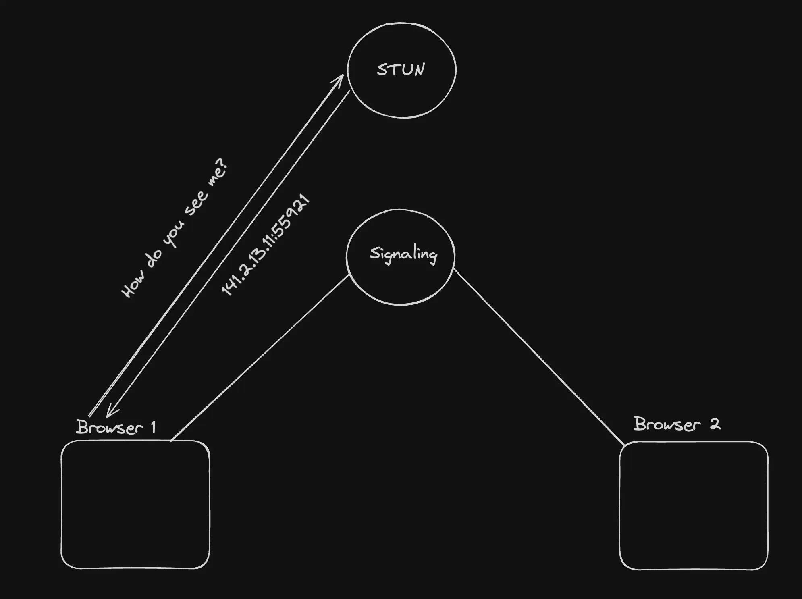
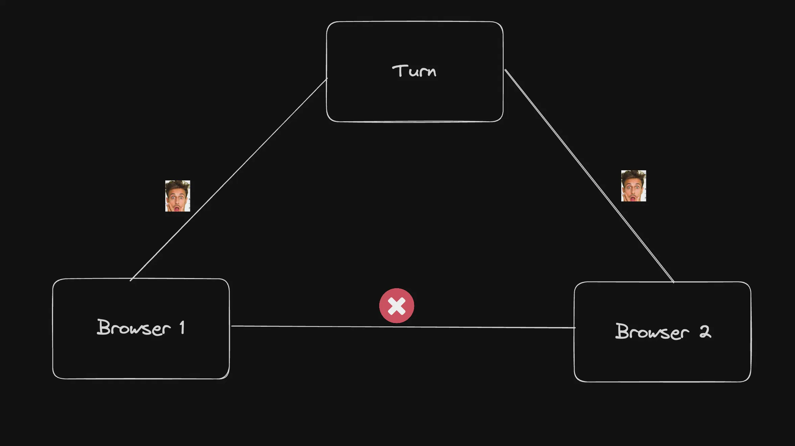
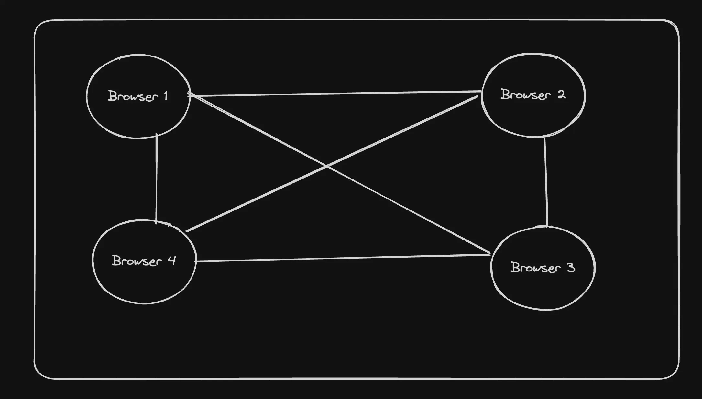
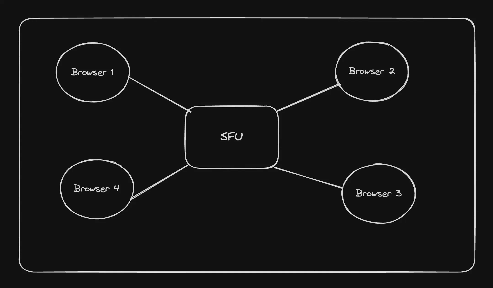

## Why WebRTC?
WebRTC is the core/only protocol that lets you do real time media communication from inside a browser.

### WebRTC Architecture/jargon
 
#### P2P
WebRTC is a peer to peer protocol. This means the you directly send your media over to the other person without the need of a central server
- Both the browsers need to exchange their address before they can start talking to each other. A signaling server is used for that. 
It is usually a websocket server but can be anything (http).
.

#### Stun (Session Traversal Utilities for NAT(Network Address Translation))
It gives you back your publically accessable IPs. It shows you how the world sees you.



#### Ice candidates
ICE (Interactive Connectivity Establishment) candidates are potential networking endpoints that WebRTC uses to establish a connection between peers. Each candidate represents a possible method for two devices (peers) to communicate, usually in the context of real-time applications like video calls, voice calls, or peer-to-peer data sharing.


#### Turn server
- fallback if connedtipn not establsihed p2p.
A lot of times, your network doesn’t allow media to come in from browser 2 . This depends on how restrictive your network is 
Since the ice candidate is discovered by the stun server, your network might block incoming data from browser 2 and only allow it from the stun server
.

#### Offer
The process of the first browser (the one initiating connection) sending their ice candidates to the other side.

#### Answer
The other side returning their ice candidates is called the answer.


### SDP - Session description protocol
- this is transferred beetween thr 2 devices through signalling server. 
A single file that contains all your 
1. ice candidates
2. what media you want to send, what protocols you’ve used to encode the media
This is the file that is sent in the offer and received in the answer.
eg:
```c 
v=0
o=- 423904492236154649 2 IN IP4 127.0.0.1
s=-
t=0 0
m=audio 49170 RTP/AVP 0
c=IN IP4 192.168.1.101
a=rtpmap:0 PCMU/8000
a=ice-options:trickle
a=candidate:1 1 UDP 2122260223 192.168.1.101 49170 typ host
a=candidate:2 1 UDP 2122194687 10.0.1.1 49171 typ host
a=candidate:3 1 UDP 1685987071 93.184.216.34 49172 typ srflx raddr 10.0.1.1 rport 49171
a=candidate:4 1 UDP 41819902 10.1.1.1 3478 typ relay raddr 93.184.216.34 rport 49172
```


### RTCPeerConnection (pc, peer connection)
This is a class that the browser provides you with which gives you access to the sdp, lets you create answers / offers , lets you send media.
This class hides all the complexity of webrtc from the developer.


## Other architectures
There are two other popular architectures for doing WebRTC
SFU
MCU
- Problems with p2p
Doesn’t scale well beyond 3-4 people in the same call


1. SFU
SFU stands for Selective forwarding unit.  
This acts as a central media server which forwards packets b/w users.
- onlt forwards does no decoding .
- diff qualities are send from user only when asked by SFU.


2. MCU

It mixes audio/video together on the server before forwarding it. 
This means it needs to
decode video/audio (using something like ffmpeg)
Mix them (create a video canvas/create a single audio stream)
Send out the merged audio stream to everyone